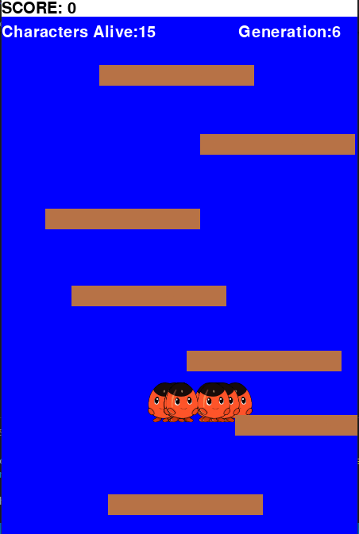

# NEAT_python_game_redjumps

NEAT python jumping platform game: 
An AI that learns to jump on platforms, using the Python implementation of the NEAT neuroevolution algorithm.

- There are 3 independent python files:

  `redjumps_withuser_inputs.py` : you can play and test the game using user inputs: left, right and up keys, to make sure that the game is playable.

  `redjumps_ai_without_neat.py` the character jumps using a movetoplatform() function.

  `redjumps_neat.py` the ai learns to jump using NEAT-python.

  

*The work on the inputs can still be improved.*

